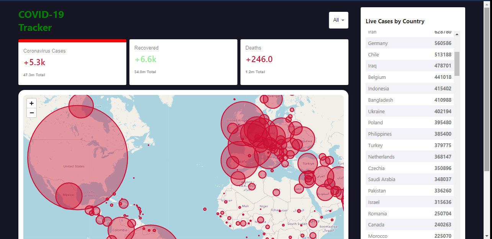

# Covid19 Tracker



## [Live Here!!](https://shivanshsharma13.github.io/covid19_tracker/)

This is a Covid reports web app from the world. We used a covid API to figure out the new cases, recovery and deaths.

## Key points

- This is a react application
- Used Covid19 API
- Used world map to showcase all covid cases
- Countries are sorted as per cases
- Click your country to showcase your country cases

## Clone the project

```
git clone https://github.com/shivkaansh/covid19_tracker.git
cd covid19_tracker
npm i
npm start
```

Made with ❤️ and React
